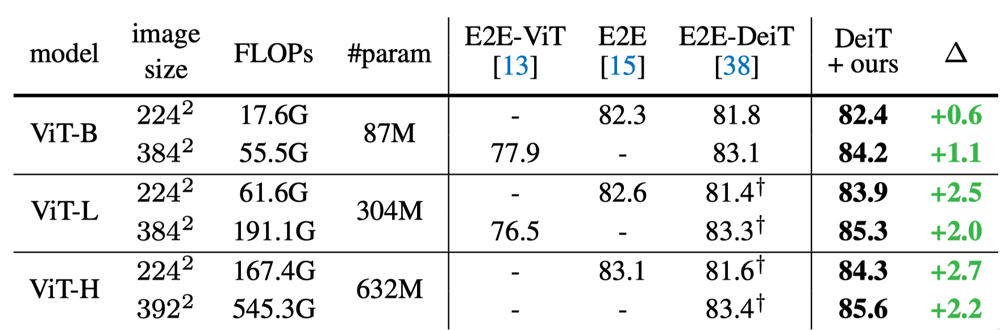

# Deep Model Assembling

This repository will be used to release the code and the pre-trained models for the Deep Model Assembling.

    

> **Title**:&emsp;&emsp;[**Deep Model Assembling**](https://arxiv.org/abs/2212.04129)  
> **Authors**:&nbsp;&nbsp;[Zanlin Ni](https://scholar.google.com/citations?user=Yibz_asAAAAJ&hl=en&oi=ao), [Yulin Wang](https://scholar.google.com/citations?hl=en&user=gBP38gcAAAAJ), Jiangwei Yu, [Haojun Jiang](https://scholar.google.com/citations?hl=en&user=ULmStp8AAAAJ), [Yue Cao](https://scholar.google.com/citations?hl=en&user=iRUO1ckAAAAJ), [Gao Huang](https://scholar.google.com/citations?user=-P9LwcgAAAAJ&hl=en&oi=ao) (Corresponding Author)  
> **Institute**: Tsinghua University and Beijing Academy of Artificial Intelligence (BAAI)  
> **Publish**:&nbsp;&nbsp;&nbsp;*arXiv preprint ([arXiv 2212.04129](https://arxiv.org/abs/2212.04129))*  
> **Contact**:&nbsp;&nbsp;nzl22 at mails dot tsinghua dot edu dot cn

## Overview

In this paper, we present a divide-and-conquer strategy for training large models. Our algorithm, *Model Assembling*, divides a large model into smaller modules, optimizes them independently, and then assemble them to obtain the final model. Though conceptually simple, our method significantly outperforms end-to-end (E2E) training in terms of both training efficiency and final accuracy. For example, on ViT-H, Model Assembling outperforms E2E training by **2.7%**, while reducing the training cost by **43%**.

    

## Results

### Results on ImageNet-1K

    

### Results on CIFAR-100

    

### Training Efficiency

- Comparing different training budgets

    

- Detailed convergence curves of ViT-Huge

    

### Data Efficiency

    

