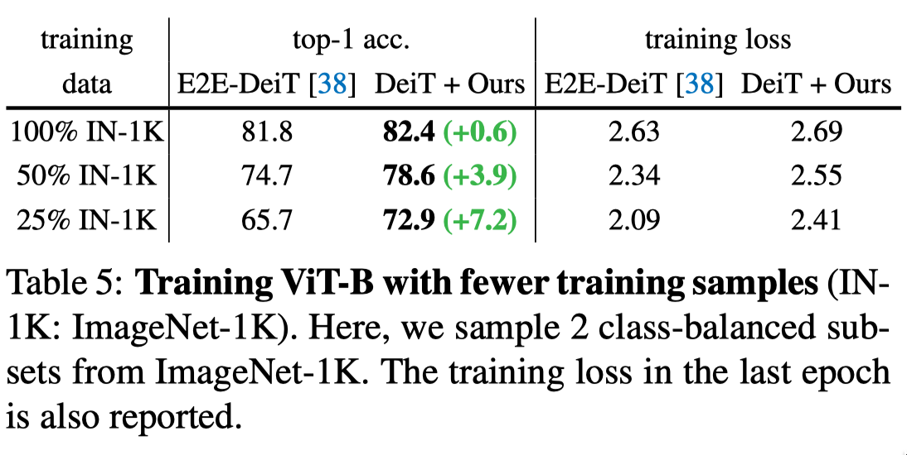

# Deep Model Assembling

This repository contains the official code for [Deep Model Assembling](https://arxiv.org/abs/2212.04129).

<p align="center">
    
</p>

> **Title**:&emsp;&emsp;[**Deep Model Assembling**](https://arxiv.org/abs/2212.04129)  
> **Authors**:&nbsp;&nbsp;[Zanlin Ni](https://scholar.google.com/citations?user=Yibz_asAAAAJ&hl=en&oi=ao)\*, [Yulin Wang](https://scholar.google.com/citations?hl=en&user=gBP38gcAAAAJ)\*, Jiangwei Yu, [Haojun Jiang](https://scholar.google.com/citations?hl=en&user=ULmStp8AAAAJ), [Yue Cao](https://scholar.google.com/citations?hl=en&user=iRUO1ckAAAAJ), [Gao Huang](https://scholar.google.com/citations?user=-P9LwcgAAAAJ&hl=en&oi=ao) (Corresponding Author)  
> **Institute**: Tsinghua University and Beijing Academy of Artificial Intelligence (BAAI)  
> **Publish**:&nbsp;&nbsp;&nbsp;*arXiv preprint ([arXiv 2212.04129](https://arxiv.org/abs/2212.04129))*  
> **Contact**:&nbsp;&nbsp;nzl22 at mails dot tsinghua dot edu dot cn

## News

- `Dec 22, 2022`: release all pre-trained models on ImageNet-1K, including models tuned at higher resolutions.
- `Dec 15, 2022`: release pre-trained models for ViT-B, ViT-L and ViT-H on ImageNet-1K.
- `Dec 13, 2022`: release pre-trained meta models for ViT-B, ViT-L and ViT-H on ImageNet-1K.
- `Dec 10, 2022`: release code for training ViT-B, ViT-L and ViT-H on ImageNet-1K.

Our final models and the pre-trained meta models are all available at [🤗 Hugging Face](https://huggingface.co/nzl-thu/Model-Assembling). Please follow the instructions in [EVAL.md](EVAL.md) and [TRAINING.md](TRAINING.md) for their usage.

## Overview

In this paper, we present a divide-and-conquer strategy for training large models. Our algorithm, Model Assembling, divides a large model into smaller modules, optimizes them independently, and then assembles them together. Though conceptually simple, our method significantly outperforms end-to-end (E2E) training in terms of both training efficiency and final accuracy. For example, on ViT-H, Model Assembling outperforms E2E training by **2.7%**, while reducing the training cost by **43%**.

<p align="center">
    
</p>


## Data Preparation

- The ImageNet dataset should be prepared as follows:

```
data
├── train
│   ├── folder 1 (class 1)
│   ├── folder 2 (class 1)
│   ├── ...
├── val
│   ├── folder 1 (class 1)
│   ├── folder 2 (class 1)
│   ├── ...

```

## Pre-trained Models & Evaluation
See [EVAL.md](EVAL.md) for the pre-trained models and the evaluation instructions.


## Training
See [TRAINING.md](TRAINING.md) for the training instructions.


## Results

### Results on ImageNet-1K

<p align="center">
    
</p>

### Results on CIFAR-100

<p align="center">
    
</p>

### Training Efficiency

- Comparing different training budgets

<p align="center">
    
</p>

- Detailed convergence curves of ViT-Huge

<p align="center">
    
</p>

### Data Efficiency

<p align="center">
    
</p>

## Citation

If you find our work helpful, please **star🌟** this repo and **cite📑** our paper. Thanks for your support!

```
@article{Ni2022Assemb,
  title={Deep Model Assembling},
  author={Ni, Zanlin and Wang, Yulin and Yu, Jiangwei and Jiang, Haojun and Cao, Yue and Huang, Gao},
  journal={arXiv preprint arXiv:2212.04129},
  year={2022}
}
```

## Acknowledgements

Our implementation is mainly based on [deit](https://github.com/facebookresearch/deit). We thank to their clean codebase.

## Contact

If you have any questions or concerns, please send mail to [nzl22@mails.tsinghua.edu.cn](mailto:nzl22@mails.tsinghua.edu.cn).
